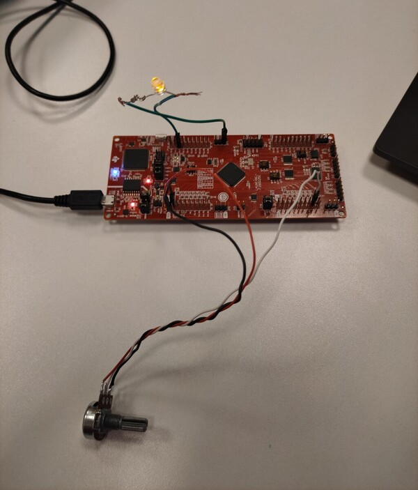
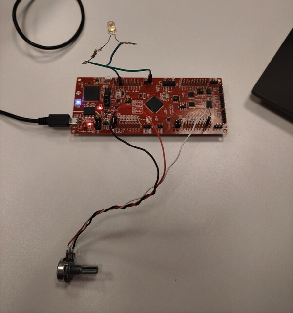

<br/>
<p align="center">
  <a href="https://github.com/talhaturac/Potentiometer_Control_PWM_Duty">
    
  </a>

  <h1 align="center">Building Embedded Software Using the LAUNCHXL-F280025C Development Kit</h1>

  <h3 align="center">
    This project is developed to control the duty cycle of PWM signals with a potentiometer.
  <br/> 
    <br/>
  </h3>


## Table Of Contents

* [About the Project](#about-the-project)
* [Built With](#built-with)
* [Usage](#usage)
* [Contact and Feedback](#contact-and-feedback)

<br/>

## About The Project

<p align="center">
  <a href="https://github.com/talhaturac/Potentiometer_Control_PWM_Duty/tree/main/images">
    
  </a>

I am actively working on development kits from Texas Instruments and developing embedded software. In this post here, I wanted to share one of the projects I have done so that you can benefit from it. Enjoy!

Why are we here:

* To create projects from Code Composer Studio IDE.
* To be able to use the ADC unit, read and use this data.
* To generate and configure PWM signals.
* To be able to set the duty cycle ratio and other parameters of the PWM signal.

You can experiment by customizing the project code to your own TI development board. Or you can use the information shared here to create your own customizations that use the ADC unit and ePWM unit. The actual code is in the main.c file. 

<p align="center">
  <a href="https://github.com/talhaturac/Potentiometer_Control_PWM_Duty/tree/main/images">
    
  </a>

<br/>

## Built With

It was built using the C programming language, via Code Composer Studio IDE, with the LAUNCHXL-F280025C (C2000 MCUs family) development kit from Texas Instruments.
             

* [Code Composer Studio IDE -> version 11.0.0.00012](https://www.ti.com/tool/download/CCSTUDIO/11.0.0.00012)
* [C2000Ware Library -> version 4.00.00.00](https://www.ti.com/tool/download/C2000WARE/4.00.00.00)
* [F280025C LaunchPad™ development kit for C2000™ real-time MCU](https://www.ti.com/tool/LAUNCHXL-F280025C)


<br/>

## Usage

First, an empty CCS project file is opened. Required adjustments and configurations are made. After selecting the target path, i.e. the target device and connection type, the software is started. The reason why I do not talk about these parts in detail is that they are available on the internet and TI's own resources. 

The software is started by including the libraries on the main.c file.

```
#include "driverlib.h"
#include "device.h"
```

<br/>

## Contact and Feedback

* [![GITHUB][github.com]][github-url]

* [![LinkedIn][LinkedIn.com]][LinkedIn-url]

* If you have any feedback, please contact me at tturac.turk@gazi.edu.tr e-mail address.
  
[github.com]: https://img.shields.io/badge/GITHUB_PROFILE-181717?style=for-the-badge&logo=github&logoColor=white
[github-url]: https://github.com/talhaturac
[LinkedIn.com]: https://img.shields.io/badge/LINKEDIN_PROFILE-0A66C2?style=for-the-badge&logo=LinkedIn&logoColor=white
[LinkedIn-url]: https://www.linkedin.com/in/talhaturacturk
